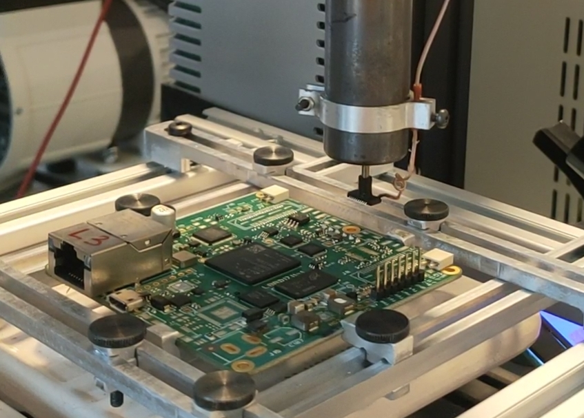
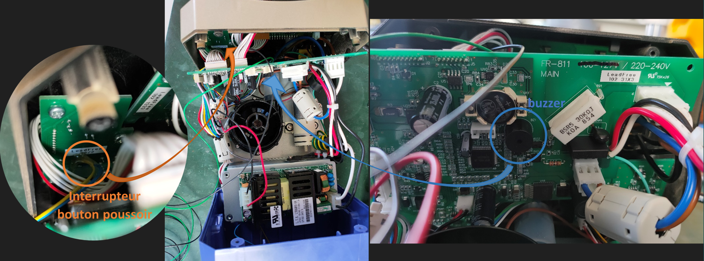
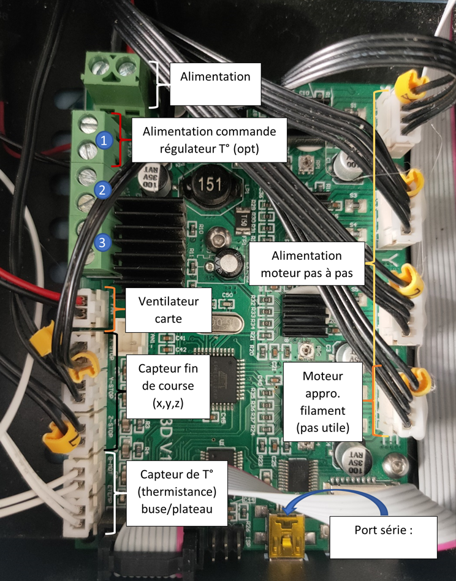

**Pick&Remove4Reuse**
---------------------
Système de récupération de composants électoniques automatisé basé sur une imprimante 3D open source Creality Ender3.

## Introduction

Ce document a pour objectif de recenser le travail effectué lors de mon stage de fin d'étude qui avait pour objectif de concevoir un système automatisé de récupération de composants électroniques (ECs). Ce domument a également pour objectif d'assister tuote personne qui souhaiteraient reproduire ou reprendre ces travaux.
Mon rapport de stage, détaillant le travail effectué se trouve à l'adresse suivante :
> "doc/Rapport_PFE_Margaux_Anne_CEA_INSA.pdf"

Lors de mon stage, j'ai pu concevoir, fabriquer et tester une station de récupération automatisée de composants électroniques en vue de leur réemploi. Les résultats sont prometteurs. La station permet une récupération de composants CMS d'une taille pouvant varier en fonction de la taille de la buse. L'impact CO2 en termes d'énergie utilisée lors de la récupération s'est révélé inférieur à celui de la fabrication. Le temps nominal de récupération d'un composant électronique est de 1'30 et peut prendre jusqu'à 2'30.

## Prise en main rapide de la station une fois mise en place
*   Positionner la carte sur le support de carte. Il est nécessaire de dévisser uniquement les vis moletées se trouvant sur le bras de gauche et du haut. Attention, les bords de la carte doivent être alignés sur le support de carte. Le coin inférieur gauche de la carte une fois positionné doit correspondre au coin auquel les composants sont référencés dans le fichier de fabrication.
*   Vérifier que la ventouse du pistolet corresponde à la taille des ECs visé pour la récupération
*   Allumer la plaque IR pour préchauffe de la carte (15 min mini)
*   Brancher la carte Arduino et l'imprimante à l'ordinateur
*   Ouvrir le script python avec Spyder
> "src\Test_imprimante_positionement.py"
*   Utiliser python 3.10  (clique-droit sur la console>New console in environment>Custom: Python310)
*   Un fichier de config permet de configurer certains paramètres, on retrouve par exemple la hauteur de sécurité afin d'éviter que le pistolet ne percute des éléments de la structure ou de la carte. On retrouve également la hauteur delta permettant le chargement du ressort, permettant le désassemblage, cette hauteur peut être modulée en fonction du positionnement du capteur de fin de course et du chargement que l'on souhaite effectuer sur le ressort. Des valeurs prédéfinies sont rentrées, il est possible de les modifier au besoin.
> "src\config.ini"
*   Allumer l'imprimante et la station Hakko
*   Lancer le programme : ce dernier va commencer par initialiser l'imprimante. Il vous demandera ensuite de fournir un fichier Excel avec la position des ECs à récupérer. Un exemple de fichier se trouve au chemin ci-dessous. Une fois le fichier fournis, il vous sera demandé de référencer le premier composant à récupérer du fichier Excel. Pour ce faire, vous pouvez vous déplacer avec la molette de l'imprimante en suivant les instructions fournie par le programme. Une fois la position validée, la récupération débute. Des messages d'information sont visibles sur l'imprimante afin de vous tenir au courant sur l'avancée de la récupération.
> "src\composants_recup.xlsx"
*   Si vous voulez interrompre la récupération, faites 'ctrl C' dans la console. Il vous sera ensuite nécessaire de débrancher et de rebrancher la carte Arduino afin de relancer le programme sans erreurs.
*   Un mode d'emploi présente les explications ci-dessus en annexe du rapport de stage.

## État de l'art
Mon stage a débuté avec l'établissement d'un état de l'art qui recense un certain nombre d'articles scientifique sur les Déchets d'Équipements Électriques et Électroniques (DEEE), le recyclage des cartes et ECs, ainsi que sur la récupération des ECs en étayant également les perspectives en termes de conception alternative afin de faciliter la récupération, la réutilisation et le recyclage des systèmes électroniques.
Le document se trouve ici:
> "doc\Rapport_bibliographique_recuperation_EC.pdf"

## Choix des outils fonctionnels
L'essentiel des outils, dispositifs, achats effectuées au cours du stage sont recensées sur:

> "documentation\Materiel.xlsx"

## Conception
Après avoir fait les différents choix fonctionnels ainsi que choisi les briques fonctionnelles, la conception des différents éléments d'intégration a débuté.
Le fichier ci-dessous contient les différents sous-fichiers correspondants aux éléments de conception. 
> "solidworks"

La CAO du système général avec tous les éléments assemblés se trouve ici:
> "solidworks\support_carte_asm_g\asm_general_v3.SLDASM"

## Commande et mesure station Hakko
Afin de commander et d'avoir un retour de la station Hakko (commande du pistolet permettant le dessoudage et le désassemblage), il a été nécessaire d'ouvrir cette dernière.
Pour ce faire, il est nécessaire de dévisser les quatre vis fixant le cadre de la face avant de la station ainsi que les deux vis se trouvant sur la face arrière de cette dernière. Le cadre du bas tient alors encore en place grâce à un clip se trouvant sur la face du bas de la station accrochant le cadre avant et le carter de la station. Une fois déclipsée, il est  ainsi possible d'ouvrir la station. L'image ci-dessous illustre nos deux points d'intérêt. À savoir, le bouton permettant l'actionnement du cycle et le buzzer donnant des informations sur l'état du cycle.

Il est alors nécessaire de souder des fils sur les bornes de l'interrupteur et celles du buzzer.

* Une fois ceci fait, les deux fils de l'interrupteur sont soudés sur un relai 5 V. L'objectif avec l'utilisation du relai est qu'il agisse comme un interrupteur commandé. Selon le signal de commande envoyé par la carte Arduino au relai, celui-ci effectue une connexion ou non entre les deux fils soudés aux bornes du bouton de la station, déclenchant/stoppant ou non le cycle de chauffe. Le fil soudé sur la commande du relai est branché sur un pin analog de la carte Arduino. Le second fil est lui relié au 5 V de l'Arduino. Une diode est également soudée entre les deux pins (commande/puissance) du relai.

* Les fils du buzzer sont eux fixés sur les pins de la carte Arduino. L'un des fils doit être relié à la masse, quant à l'autre à un pin digital (PWM) de l'Arduino. Lors du soudage des fils, celui devant être relié à la masse doit être vérifié. Pour cela, testez avec un multimètre quelle borne du buzzer y est connectée en vous aidant de la pile (se trouvant à côté de ce dernier sur la carte de la station) qui a elle-même une borne reliée à la masse.

## Intégration du capteur de fin de course:
Le capteur de fin de course est relié à la carte Arduino. Ce dernier possède 3 bornes. Une étude de la datasheet vous permettra de comprendre son fonctionnement. Dans la pratique, l'une des bornes sera reliée à l'alimentation de la carte (3,5 V par exemple) et l'autre à un pin digital de l'Arduino. Pour le bon fonctionnement, une résistance de pull down est également nécessaire pour cette même sortie.

## Commande - Script Python
En parallèle de la conception des différents éléments d'intégration, la commande du système a été conçue. Cette dernière est assurée par un script Python se trouvant ici :
> "src\PickRemove.py"

Ce dernier est associé à un fichier de configuration généré par un script Python permettant la modification de certains paramètres. Le réglage des paramètres est détaillé par la suite.

Afin que le script fonctionne, plusieurs choses sont nécessaires:

* Connexion en port série avec l'imprimante 3D : connecter l'imprimante et l'ordinateur en vérifiant que le numéro du COM série pré-rentré dans le fichier de configuration est le bon (vérifier à l'aide du gestionnaire de périphérique de votre ordinateur)

* Connexion à la carte Arduino permettant le contrôle du cycle de chauffe, la mesure de l'étape de ce dernier ainsi que l'état du capteur de fin de course. Connecter en port série la carte Arduino et l'ordinateur. Comme pour l'imprimante 3D, il est nécessaire de vérifier le numéro du COM série pré-rentré dans le fichier de configuration. 
Afin de configurer la carte Arduino lors de la première utilisation, un programme doit lui être transféré, permettant d'utiliser la librairie PyFirmata utilisée dans le script Python. Il est alors nécessaire de se rendre dans l'IDE Arduino 
`Fichier>Exemples>Firmata>StandarFirmata`

* Installer les différentes librairies :

    * Pour installer la bibliothèque pyFirmata il faut taper la commande suivante dans la console Python : `!pip install pyfirmata`

* Installation de la version `Python 3.10` afin d'utiliser la librairie pyFirmata. Une fois l'installation effectuer, il faudra dans la console Python générer une nouvelle console avec la version 3.10 (clique-droit sur la console>New console in environment>Custom: Python310).

## Réglage script Python
Les différents paramètre modifiable, pour le réglage du système de récupération, sont regroupés dans un fichier de configuration modifiable :

> "src\config.ini"

> "src\Creation_fichier_config.py"

Celui-ci permet de définir certains paramètre expliqué ci-dessous :
[DEFAULT]
* portImprimante = COM7
* portArduino = COM5
* baudrate = 115200 : vitesse de discussion entre le script Python et l'Arduino
* pin_finDeCourse = 7
* pin_buzzer = 2
* pin_relaiCycleChauffe = 4

[Constante]
* vitesse_deplacement = 3000 : définition de la vitesse de déplacement de l'imprimante

* pos_x_min_depose_ec = 96 : définition de la position en x du premier emplacement de dépose d'EC.
* pos_x_max_depose_ec = 229 : définition de la position en x du dernier emplacement de dépose d'EC.
* espacement_ec_depose_x = 19 : Espacement en x entre deux positions de dépose.
* pos_y_min_depose_ec = 35 : définition de la position en y du premier emplacement de dépose d'EC.
* pos_y_max_depose_ec = 38.8 : définition de la position en y du dernier emplacement de dépose d'EC.
* espacement_ec_depose_y = 0.4 : Espacement en y entre deux positions de dépose.
* hauteur_secu_z = 35 : hauteur de sécurité afin de ne pas percuter des éléments avec le pistolet lors de ses déplacements en x et y.
* delta_z_posDesassemblage = 4 : distance delta nécessaire pour venir charger le ressort lors du désassemblage.

## Initialisation station Hakko
Initialisation du cycle de chauffe dans la station Hakko. Le cycle de chauffe prédéfini à charger sur la station se trouve ici:
>"src\Hakko\cycle_chauffe_hakko.csv"

Trois options s'offrent à vous :
* Réglage manuel directement sur la station
* Import du cycle via une clé USB
* Import du cycle via le port série de l'ordinateur (nécessite l'installation d'un pilote sur l'ordinateur). La démarche à suivre est décrite dans le manuel d'utilisation de la station.

La courbe de température à suivre est détaillée dans le fichier OneNote ci-dessous :
>"doc\Température dessoudage.one"

## Modification Imprimante 3D
*   **Modification des branchements de la carte**:
La carte de l'imprimante 3D se trouvant sous le plateau de cette dernière (cf image ci-dessous) permet de commander l'imprimante en position avec la commande de trois moteurs pas à pas (un pour chaque axe). Afin de faire le 0 de l'imprimante, la présence de capteurs de fin de course est également nécessaire. Nous retrouvons aussi un ventilateur permettant de prévenir la carte d'une potentielle surchauffe. La carte est par ailleurs alimentée, nous retrouvons ainsi deux fils branchés sur un bornier dans le but d'assurer cette fonction.
Outre ces fonctions, on retrouve aussi des éléments propres à l'impression 3D : alimentation de la chauffe de la buse (bornier 3 sur l'image ci-dessous) et du plateau (2), ventilateur lié à la buse (1), thermistance afin de mesurer la température de la buse et du plateau et permettre leur régulation respective. Ces derniers éléments ne nous sont plus nécessaires, ainsi, nous pouvons les enlever pour ne garder que l'utile de l'imprimante. Attention, il n'est néanmoins pas possible de retirer les thermistances. En effet, une fois débranchée, la température mesurée est erronée, ce qui engendre une erreur de l'imprimante. Ainsi, nous pouvons uniquement retirer les éléments branchés aux trois borniers latéraux gauches (1,2 et 3) ainsi que la commande du moteur d'approvisionnement en filament. Le premier bornier, initialement prévu pour l'alimentation du ventilateur associé à la buse d'impression, fournit une tension de 24V en continu. Ainsi, nous pouvons nous en servir afin de brancher un régulateur en température si besoin est de réguler la plaque IR. Dans mon cas d'étude, la plaque IR était alimentée à 60V, avec un générateur de puissance, ce qui ne permettait pas d'atteindre une température de préchauffe de la carte supérieure à 130°C. Ainsi, il n'a finalement pas été nécessaire de la réguler en température, étant donné que le seuil de préchauffe à ne pas dépasser est beaucoup plus haut (150-200°C). S'il vous est nécessaire de réguler en température la plaque, il est alors possible d'utiliser un régulateur de température, en fonction de la tension de commande max de l'outil en question, vous aurez peut-être besoin de réguler la tension sortant du bornier avec un régulateur 24V --> 5V par exemple. La puissance peut elle provenir directement du générateur 60V dans le cas où votre régulateur est isolé entre la commande et la puissance.

*   **Modification sur la structure de l'imprimante:**
    * Afin de limiter le poids se trouvant sur la structure de l'imprimante se déplaçant selon z, vous pouvez démonter le moteur pas à pas initialement prévu pour l'approvisionnement en filament.
    
    * Afin de limiter la course de l'imprimante selon z et ainsi empêcher la collision du pistolet avec la structure de l'imprimante, il est conseiller de déplacer le capteur de fin de course de l'axe z vers le haut (il est possible qu'il soit nécessaire de rallonger les fils reliant ce dernier à la carte de l'imprimante présenté en amont)

    * La tête d'impression tout comme la plaque chauffante doivent être démonté. Le pistolet sera intégré directement sur le support de la tête d'impression (comme illustré dans la CAO générale du système introduite en amont). Le support de carte sera lui monté directement sur le support de la plaque chauffante, tout comme le support de la plaque IR.